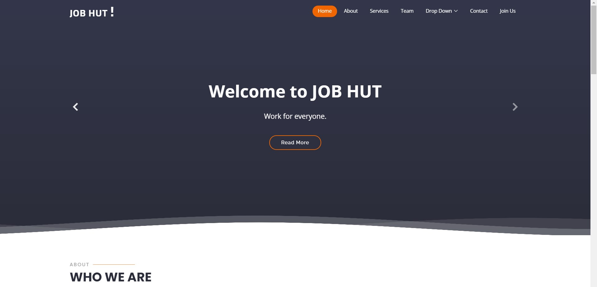
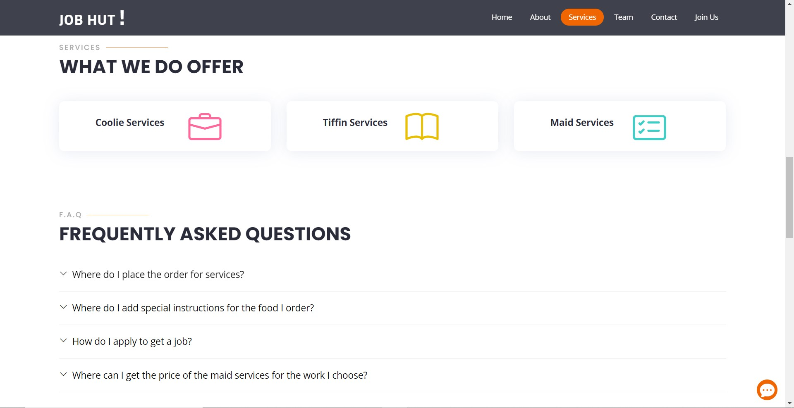
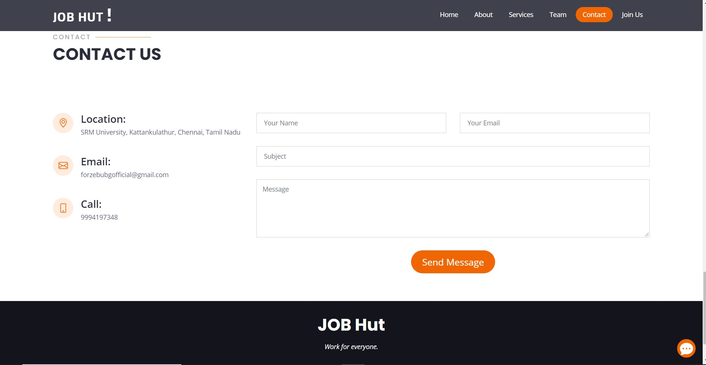

# JobHut
# Submission by Team FORZE for Hack BMU
Entry of Forze, from SRM Institute of Science and Technology, Kattankulathur, to Hack BMU.

Open Innovation: An open-ended theme where the only restriction is your imagination. Build the ideas that you believe in and make a difference. It can either be hardware or software.
Our Approach : We decided to come up with a Solution which makes the lives of people easy by availing them various job facilities and by generating jobs for many through our platform.

<h2 align= "left"><b>Our Product</b></h2>

We Forze present before you,<b>"JOBHUT"</b>- DO MORE... . We will be e helping you with our coolies at railway station, maids at home, tiffin delivery services when you are tired and don't wish to cook. These services won't be free but would be completely worth the money.

<h2 align= "left"><b>Website in a Print view</b></h2>

 &ensp;
 &ensp;
 &ensp;
 &ensp;
 &ensp;
 &ensp;
 &ensp;

## Presentation
[PPT](https://drive.google.com/file/d/1kqKWkmLGT0XD-7vUlV8FsSA8OiObbJCF/view?usp=sharing)

## Tech Stack

- eJS,CSS,Bootstrap

- jQuery,notifyJS

- Webkit Speech recognition API

- Firebase Storage.

<h2 align= "left"><b>Our Product can be viewed at:-</b></h2>

- Website Link : <a href="https://aaditya188.github.io/JobHut/">https://aaditya188.github.io/JobHut/</a>
- Youtube Demo : <a href="https://www.youtube.com/watch?v=OOI3jXhj3m4">https://www.youtube.com/watch?v=OOI3jXhj3m4</a>

